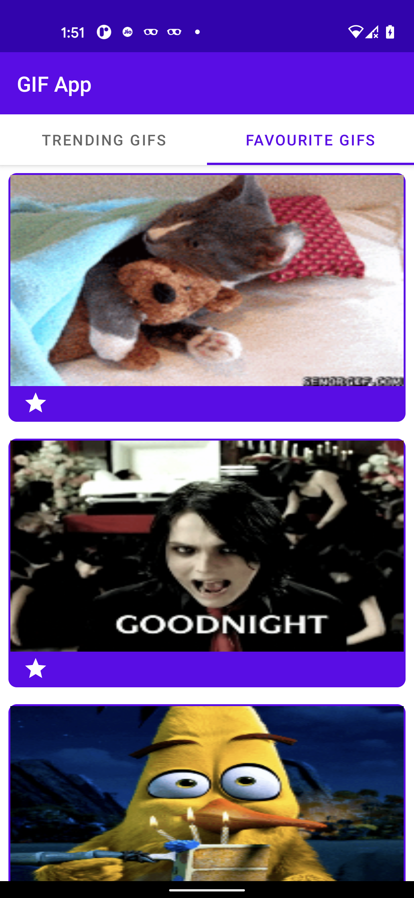

# Gif App

Used the Giphy API to create an Android app which allows users to search, view, favourite,
and unfavourite GIFs

GifFresh uses MVVM CleanCode MultiModules architecture using Kotlin(100%), Room, Retrofit, Koin, Glide, Paging, Material Design.
and test cases

  
   

## Features
- Trending gif
- Add gifs to Favourite

## Tools

- Android Studio 
- Kotlin 
- Gradle 
- Github

## ThirdParty Library

- Kotlin-coroutine
- Koin  
- Material Design 
- retrofit 
- room 
- paging
- glide

